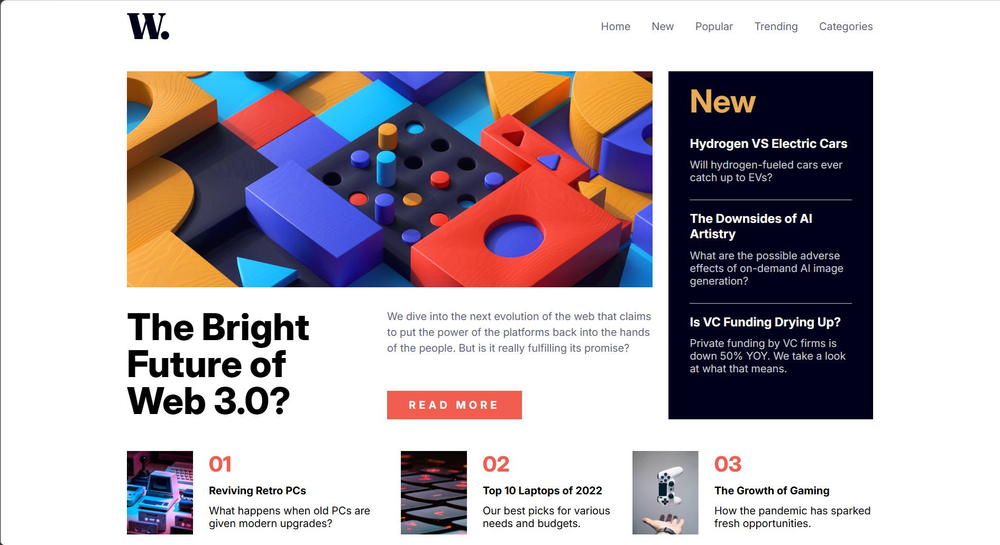
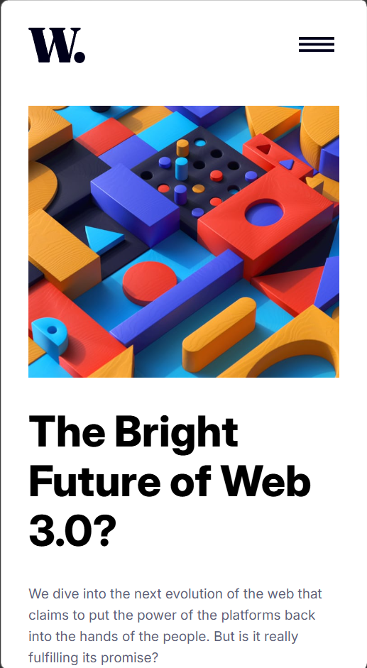
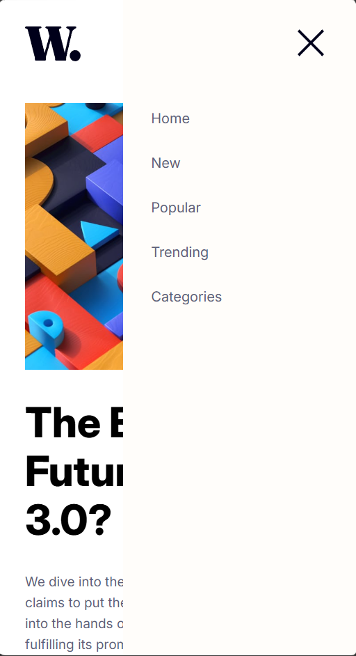

# Frontend Mentor - News homepage solution

This is a solution to the [News homepage challenge on Frontend Mentor](https://www.frontendmentor.io/challenges/news-homepage-H6SWTa1MFl). Frontend Mentor challenges help you improve your coding skills by building realistic projects. 

## Table of contents

- [Overview](#overview)
  - [The challenge](#the-challenge)
  - [Screenshot](#screenshot)
  - [Links](#links)
- [My process](#my-process)
  - [Built with](#built-with)
  - [What I learned](#what-i-learned)
  - [Continued development](#continued-development)
  - [Useful resources](#useful-resources)
  - [AI Collaboration](#ai-collaboration)
- [Author](#author)
- [Acknowledgments](#acknowledgments)

## Overview

### The challenge

Users should be able to:

- View the optimal layout for the interface depending on their device's screen size
- See hover and focus states for all interactive elements on the page

### Screenshot





### Links

- Live Site URL: [News Homepage Live](https://ftmae.github.io/Frontend-Mentor-News-Homepage-Main/)

## My process

### Built with

- Semantic HTML5 markup
- CSS custom properties
- Flexbox
- Mobile-first workflow
- [React](https://reactjs.org/) - JS library

### What I learned

This challenge was my first time working with a more complex layout, it helped solidify my understanding of flexbox and responsive design. Showing different images and also changing how the header is shown based on the type of device was new to me and I'm extremely proud of how I figured it out and implemented it myself!

Here's a snippet of the Header component, it's the bit I am most proud of for sure!

```jsx
<import { useEffect, useState } from 'react';
import logo from '../../assets/images/logo.svg';
import menuIcon from '../../assets/images/icon-menu.svg';
import closeMenu from '../../assets/images/icon-menu-close.svg';
import NavList from './NavList.jsx';
import './header.css';

export default function Header(){
    const [size, setSize] = useState(window.innerWidth);
    const [isOpen, setIsOpen] = useState(false);

    useEffect(()=>{
        function handleResize(){
            console.log('resizing');
            setSize(window.innerWidth);
        }
        window.addEventListener('resize', handleResize);
        return ()=> window.removeEventListener('resize', handleResize);
    }, []);

    function handleClick(){
        setIsOpen(prev=> !prev);
    }
    return (
        <header className="flex-row align-center mb-3">
            
            <nav>
            { 
                size <= 768 ? 
                    <>
                        <button onClick={handleClick} className='bg-trans border-trans'></button> 
                        <div className='header-menu' aria-expanded={isOpen}>
                            <NavList flexDirection='flex-column'/>
                        </div>
                    </>
                    : 
                    <NavList flexDirection='flex-row'/>
            }
            </nav>
        </header>
    )
}
```

```css
.nav-list{
    list-style-type: none;
    padding: 0;
    margin: 0;
}

.nav-list li:hover{
   color:  hsl(var(--clr-red));
}

.header-menu{
    position: fixed;
    top: 0;
    right: 0;
    display: flex;
    flex-direction: row-reverse;
    justify-content: space-between;
    background-color: hsl(var(--clr-white));
    gap: 1rem;
    z-index: 5;
    transition: transform 450ms ease-out;
    transform: translateX(100%);
}

.header-menu > ul{
    margin-top: 7rem;
    min-height: 100vh;
    width: 65vw;
    padding: 1rem 2rem;
}

.header-menu[aria-expanded="true"]{
    transform: translateX(0%);

}
nav > button{
    position: relative;
    z-index: 10;
}

header > img{
    margin-right: auto;
}
```

### Continued development

Although doing this challenge was a leap for me, I still have a long way to go before I am a CSS Guru. I want to work on even more complex layouts and improve my ability to make my design responsive even without media queries, that is a part I recognize still needs development.

### Useful resources

- [An Interactive Guide to Flexbox by Josh Comeau](https://www.joshwcomeau.com/css/interactive-guide-to-flexbox/) - Definitely the best flexbox tutorial I've ever gone through. My favorite parts are the interactive sections that help visualize how the layout changes depending on the direction and alignment you choose.

## Author

- Frontend Mentor - [@ftmae](https://www.frontendmentor.io/profile/ftmae)
- GitHub - [@ftmae](https://github.com/ftmae)
